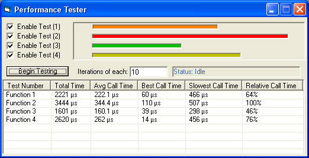



## Performance Analyser

### Description

Ever had a time when you cant figure out which alogrithm is fastest ? Well i know i have, thats why i created this small little application where you can can run & test upto 4 variations of your code.

If you find this useful, please remember to vote :)

Results are displayed in in Micro Seconds (100,000th's of a second). Multiple Iteration counter and avg'ing of results is also included with a graph to give you visual results.

If you find this useful, please vote :)
 
### More Info
 
Atleast 1 Block of code to test

There is an included Module with 4 Subs (replace with functions if you wish). Just insert the code you wish to test. Slight Changing of the code could allow you to test more complex situations.

Execution Speeds and Chart.

Some systems do not support the QueryPerformance Counter. One could use the GetTime API, but i needed this specifically.

             |
---                |---
**Submitted On**   |2003-07-14 20:53:16
**By**             |[WayneO](https://github.com/Planet-Source-Code/PSCIndex/blob/master/ByAuthor/wayneo.md)
**Level**          |Beginner
**User Rating**    |4.5 (18 globes from 4 users)
**Compatibility**  |VB 6\.0
**Category**       |[Debugging and Error Handling](https://github.com/Planet-Source-Code/PSCIndex/blob/master/ByCategory/debugging-and-error-handling__1-26.md)
**World**          |[Visual Basic](https://github.com/Planet-Source-Code/PSCIndex/blob/master/ByWorld/visual-basic.md)
**Archive File**   |[Performanc1614177142003\.zip](https://github.com/Planet-Source-Code/wayneo-performance-analyser__1-46896/archive/master.zip)

### API Declarations

QueryPerformanceCounter.

